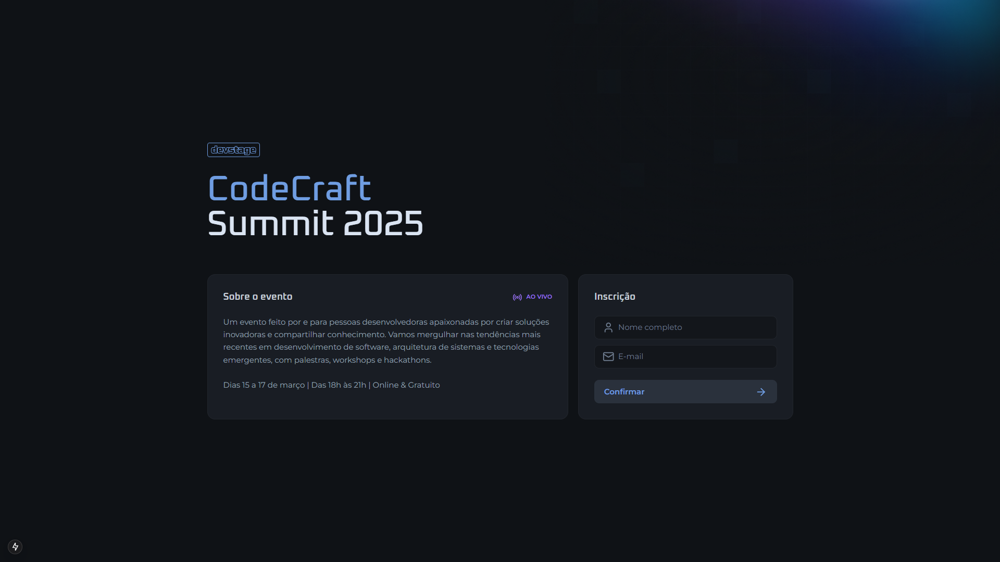
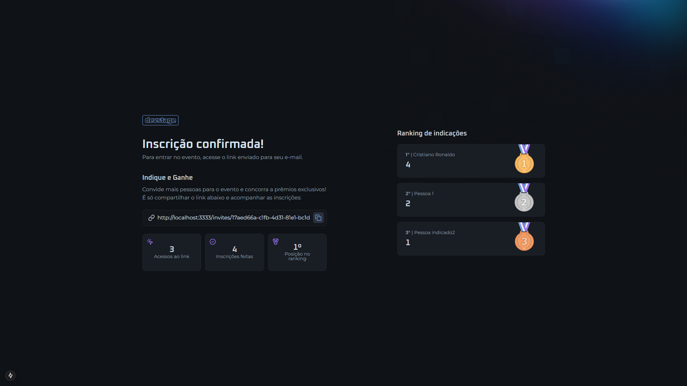

# Devstage




>Devstage é um sistema para cadastro em um evento gratuito e online.


## 🚀 Tecnologias
### 🔷 Back-end
<p align="left">
  
  
  
</p>

- [NodeJS](https://nextjs.org/)
- [Fastify](https://fastify.dev/)
- [Swagger](https://swagger.io/)
- [Drizzle-ORM](https://orm.drizzle.team/)
- [Ioredis](https://github.com/redis/ioredis)
- [PostgreSQL](https://www.postgresql.org/)
- [Zod](https://zod.dev/)

### 🔷 Front-end
<p align="left">
  
  
  
</p>

- [Next.js](https://nextjs.org/)
- [React](https://reactjs.org/)
- [Tailwind CSS](https://tailwindcss.com/)
- [React Hook Form](https://react-hook-form.com/)
- [Orval]()
- [Zod](https://zod.dev/)

## 💻 Pré-requisitos

Antes de começar, verifique se você atendeu aos seguintes requisitos:

- Ter o [NodeJS](https://nodejs.org/pt) instalado na máquina
- Ter o [Docker](https://www.docker.com/) instalado na máquina

## ☕ Usando devstage

-> Para usar devstage, siga estas etapas:

Após inicializar os container do PostgreSQL e Redis, instalar as dependência `<npm i>` dentro das diretórios frontend e backend. Ainda dentro do diretório backend, executar os comandos:

```
npm run generate
```
E depois 
```
npm run migrate
```

## 📫 Contribuindo para devstage

Para contribuir com devstage, siga estas etapas:

1. Bifurque este repositório.
2. Crie um branch: `git checkout -b <nome_branch>`.
3. Faça suas alterações e confirme-as: `git commit -m '<mensagem_commit>'`
4. Envie para o branch original: `git push origin <nome_do_projeto> / <local>`
5. Crie a solicitação de pull.

Como alternativa, consulte a documentação do GitHub em [como criar uma solicitação pull](https://help.github.com/en/github/collaborating-with-issues-and-pull-requests/creating-a-pull-request).

## 🤝 Colaboradores

Agradecemos às seguintes pessoas que contribuíram para este projeto:

<table>
  <tr>
    <td align="center">
      <a href="#" title="defina o título do link">
        <br>
        <sub>
          <b>César Daniel</b>
        </sub>
      </a>
    </td>
  </tr>
</table>

## Mais Prints 🖥️


> Página Invite